# Photoshop

Графический редактор, реализованный на базе SFML

## Возможности

### Рисование кистью

Возможность выбора цвета. При реализации использована интерполяция.

### Геометрические фигуры

**Доступны**

- прямоугольник
- эллипс
- линия

### Фильтры

**Барельеф**

<table>
  <tr>
    <td align="center">
      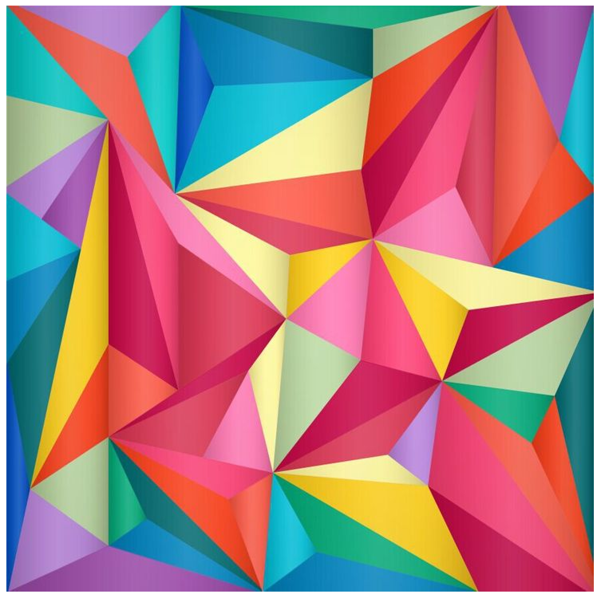
       
      <small>До</small>
    </td>
    <td align="center">
      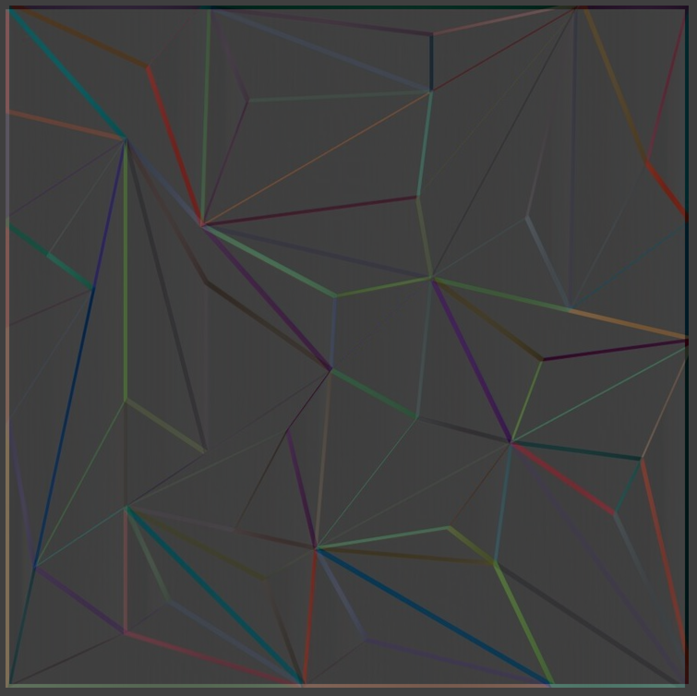
       
      <small>После</small>
    </td>
  </tr>
</table>

**Нерезкое маскирование**

<table>
  <tr>
    <td align="center">
      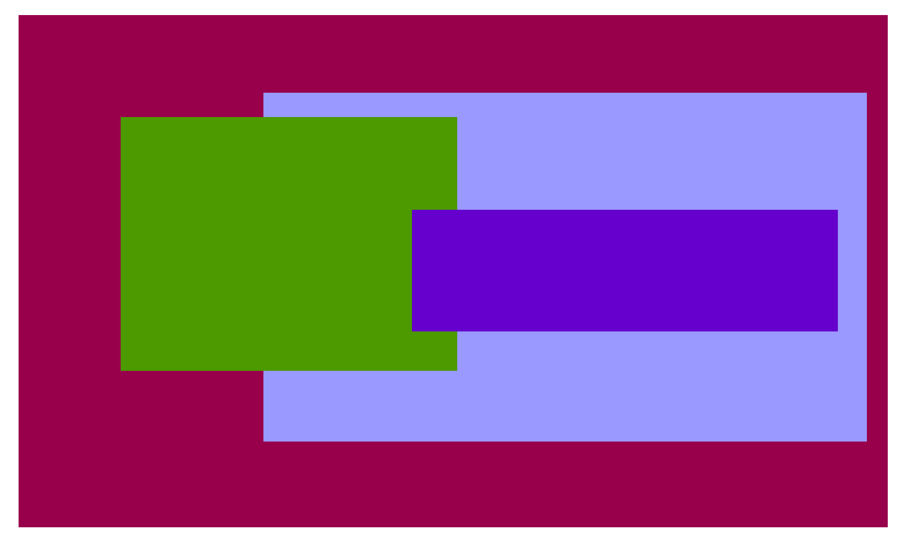
       
      <small>До</small>
    </td>
    <td align="center">
      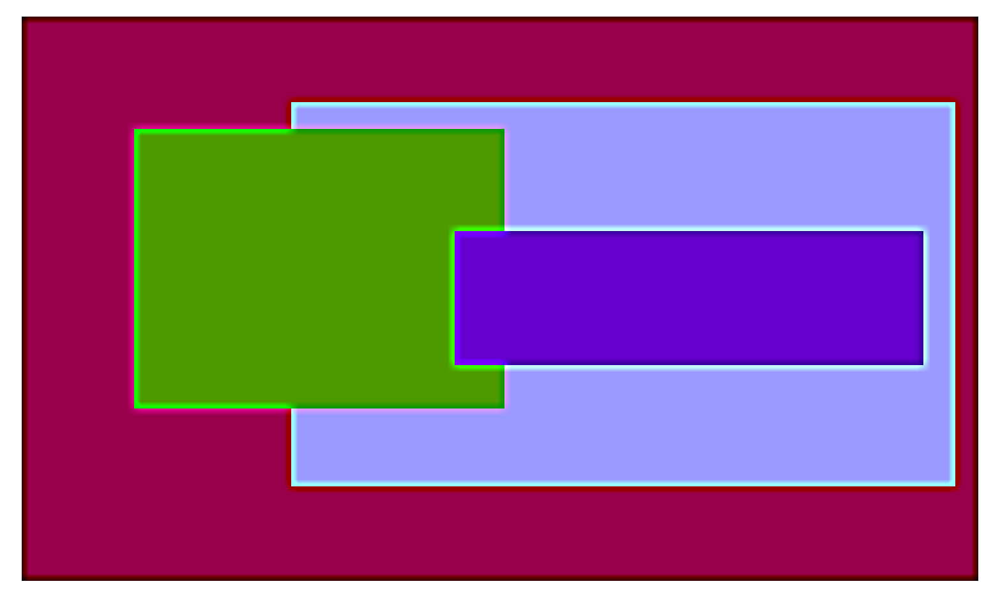
       
      <small>После</small>
    </td>
  </tr>
</table>

**Обычное размытие**

<table>
  <tr>
    <td align="center">
      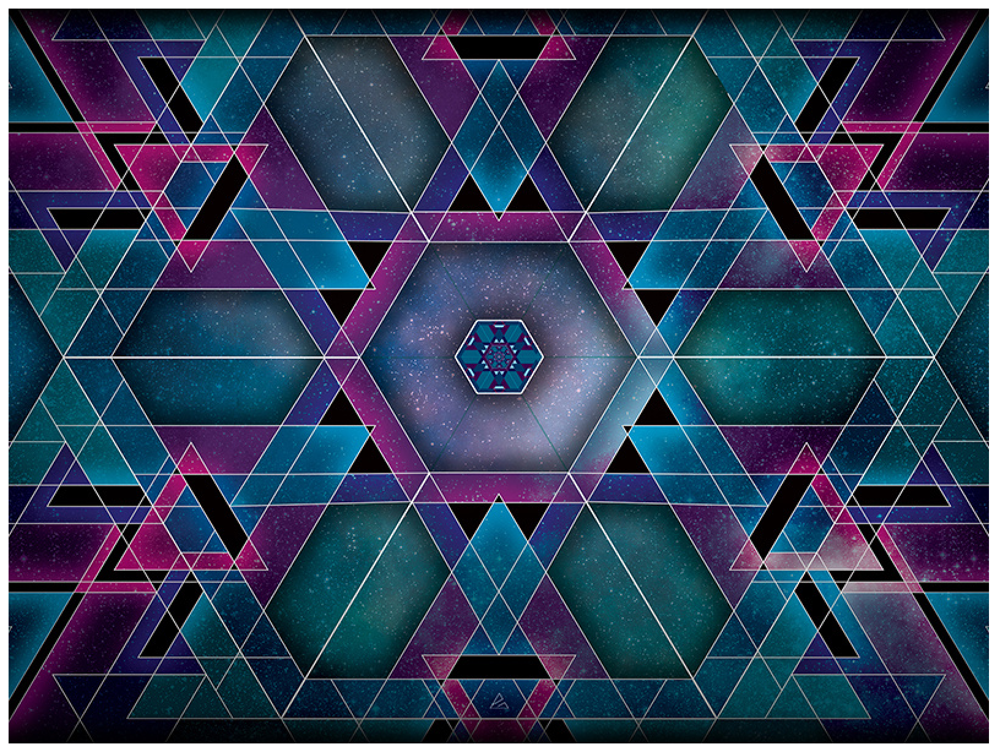
       
      <small>До</small>
    </td>
    <td align="center">
      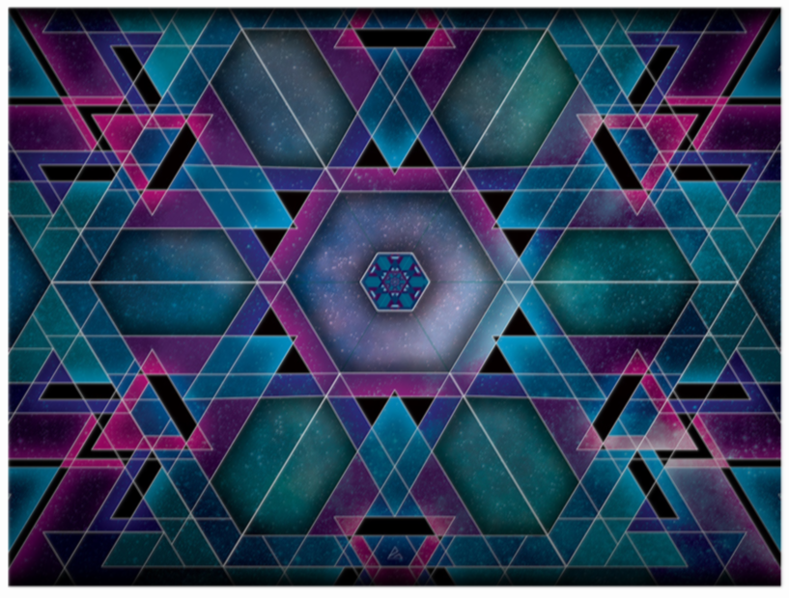
       
      <small>После</small>
    </td>
  </tr>
</table>

**Негатив**

<table>
  <tr>
    <td align="center">
      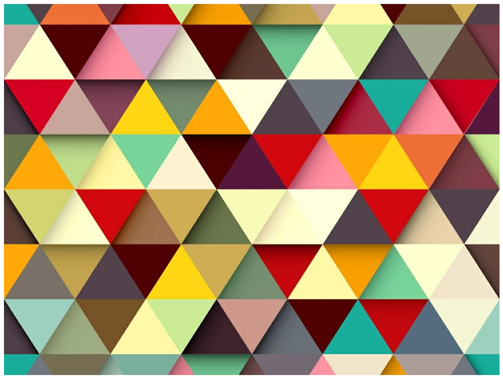
       
      <small>До</small>
    </td>
    <td align="center">
      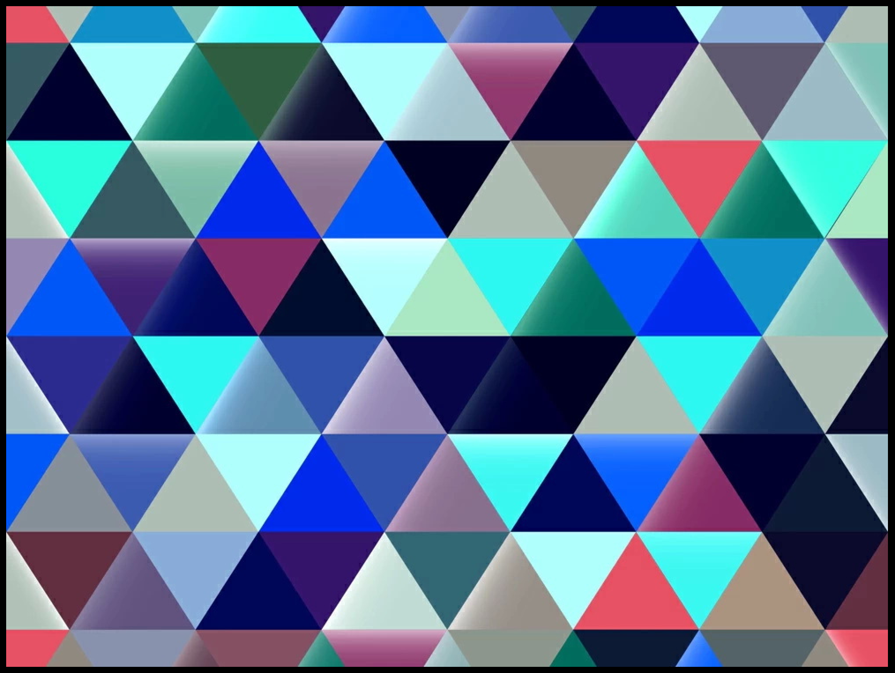
       
      <small>После</small>
    </td>
  </tr>
</table>

**Яркость**

Для фильтра яркости доступна панель для выбора уровня яркости для всех вертикальных зон индивидуально.

<table>
  <tr>
    <td align="center">
      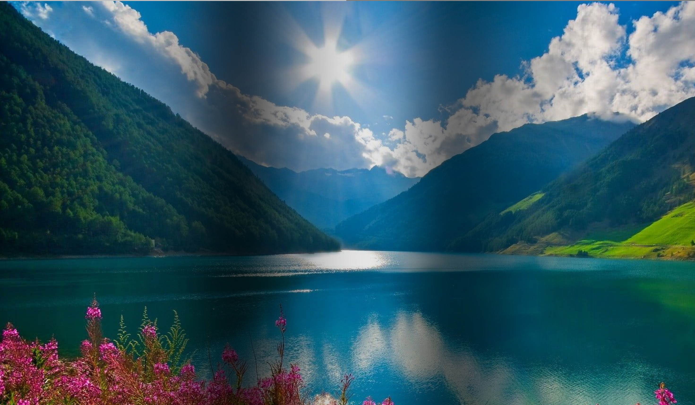
       
      <small>Изображение</small>
    </td>
    <td align="center">
      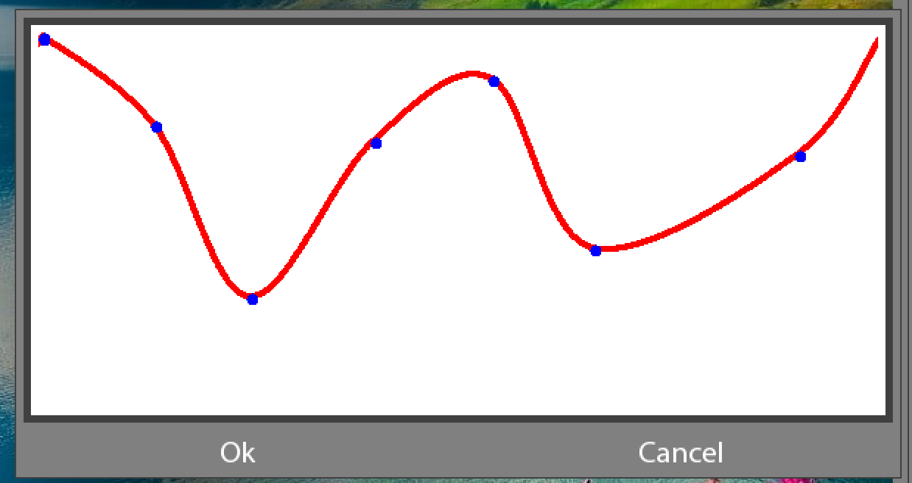
       
      <small>Панель</small>
    </td>
  </tr>
</table>

**Размытие Гаусса**

<table>
  <tr>
    <td align="center">
      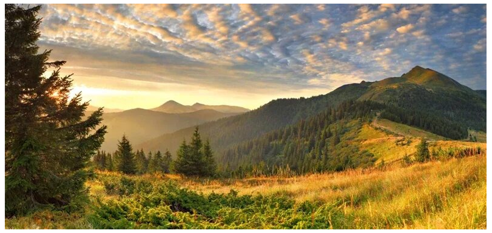
       
      <small>До</small>
    </td>
    <td align="center">
      
       
      <small>После</small>
    </td>
  </tr>
</table>

## Плагины

Добавлять новые инструменты и фильтры можно при помощи динамически загружаемых плагинов, которые должны соответствовать [api](api/).
